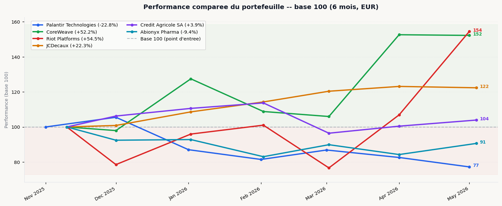

# Rapport de Portefeuille v5.4 -- 15/05/2026 10:56 (Paris)

---

## Contexte Economique

**Tendance : Neutre** | Score macro : 4.2/10
**EUR/USD :** 1 EUR = 1.1634 USD

| Indice | Variation | Cours |
|--------|-----------|-------|
| S&P 500 | ^ +0.77% | 7,501.24 |
| CAC 40 | v -1.18% | 7,986.70 |
| Nikkei 225 | v -1.99% | 61,409.29 |

**Manchettes macro :**

- Notice of the Annual General Meeting of Akcinė prekybos bendrovė “APRANGA” shareholders
- Pranešimas apie Akcinės prekybos bendrovės „APRANGA“ šaukiamą eilinį visuotinį akcininkų susirinkimą
- BIC discontinues Rocketbook and its Skin Creative activities
- BIC discontinue les activités de Rocketbook et de Skin Creative
- BIC annonce la nomination d’un nouveau Directeur Financier

---

## Analyse par Valeur

### Palantir Technologies `PLTR.US`

| Cours | Variation | VM | P&L Brut | P&L Net | Score | Recomm. |
|-------|-----------|-----|----------|---------|-------|---------|
| 114.95 EUR | - +0.00% | 229.91 EUR | - -8.21 EUR (-3.5%) | - -22.11 EUR (-9.0%) | **4.8/10** | GARDER |

**Actualite recente :** *(source : RSS Yahoo Finance (brut))*

> Prediction: This Could Be Palantir's Stock Price By the End of 2027 | Stock Market Today, May 14: U.S. Indexes Move Higher as Cisco Pops and AI-Chipmaker Cerebras Debuts | Palantir-Backed Ondas Stock Soars. Autonomous Drone Company Sees Revenue Grow 1,065%.

**Sentiment :** Bull 83% / Bear 17% *(source : Lexical (AV:vide, FH:HTTP 403))*
**Consensus :** SB:11 B:15 H:10 S:1 SS:1 *(source : Finnhub)*

**Momentum mensuel :** BAISSIER (1M: -6.5% / 3M: -5.2% / 6M: -22.8%) *(source : Cache)*

**Justification :** Perte nette -22.11 EUR (-9.0%) apres frais. Consensus haussier (score 7.2/10, Bull 83%). Contexte macro neutre. Momentum mensuel BAISSIER (score historique 1.0/10).

---

### CoreWeave `CRWV.US`

| Cours | Variation | VM | P&L Brut | P&L Net | Score | Recomm. |
|-------|-----------|-----|----------|---------|-------|---------|
| 98.19 EUR | - +0.00% | 196.37 EUR | + +8.55 EUR (+4.5%) | - -5.35 EUR (-2.8%) | **6.5/10** | ACHAT MODERE |

**Actualite recente :** *(source : RSS Yahoo Finance (brut))*

> DA Davidson, Citizens Lift Nebius Targets After 684% Revenue Quarter | CIBC Capital Markets CDRs Closes the Market | Better Datacenter Stock: CoreWeave (CRWV) or Nebius (NBIS)?

**Sentiment :** Bull 46% / Bear 54% *(source : AlphaVantage NLP)*
**Consensus :** SB:10 B:18 H:12 S:1 SS:1 *(source : Finnhub)*

**Momentum mensuel :** HAUSSIER (1M: -0.3% / 3M: +39.9% / 6M: +52.2%) *(source : Cache)*

**Justification :** Perte nette -5.35 EUR (-2.8%) apres frais. Consensus haussier (score 7.1/10, Bull 46%). Contexte macro neutre. Momentum mensuel HAUSSIER (score historique 8.5/10).

---

### Riot Platforms `RIOT.US`

| Cours | Variation | VM | P&L Brut | P&L Net | Score | Recomm. |
|-------|-----------|-----|----------|---------|-------|---------|
| 21.16 EUR | - +0.00% | 126.97 EUR | + +31.93 EUR (+33.6%) | + +18.03 EUR (+17.7%) | **9.1/10** | ACHAT FORT |

**Actualite recente :** *(source : RSS Yahoo Finance (brut))*

> AI boom turns bitcoin miners Into Wall Street’s hottest data center bet | Should You Hold APLD at 16.9x P/S? 3 Reasons Despite the Premium | Terrestrial Energy Q1 Earnings Call Highlights

**Sentiment :** Bull 100% / Bear 0% *(source : Lexical (AV:vide, FH:HTTP 403))*
**Consensus :** SB:6 B:17 H:2 S:0 SS:0 *(source : Finnhub)*

**Momentum mensuel :** HAUSSIER (1M: +44.5% / 3M: +52.9% / 6M: +54.5%) *(source : Cache)*

**Justification :** Gain net +18.03 EUR (+17.7%) apres frais. Consensus haussier (score 7.9/10, Bull 100%). Contexte macro neutre. Momentum mensuel HAUSSIER (score historique 10.0/10).

---

### JCDecaux `DEC.PA`

| Cours | Variation | VM | P&L Brut | P&L Net | Score | Recomm. |
|-------|-----------|-----|----------|---------|-------|---------|
| 18.82 EUR | ^ +0.21% | 37.64 EUR | + +2.10 EUR (+5.9%) | - -1.88 EUR (-5.0%) | **6.9/10** | ACHAT MODERE |

**Actualite recente :** *(source : RSS Yahoo Finance (brut))*

> 2026 Annual General Meeting of JCDecaux SE of 13 May 2026 | A Look At JCDecaux (ENXTPA:DEC) Valuation After Recent Share Price Momentum | JCDecaux : Q1 2026 trading update, solid revenue growth driven by digital

**Sentiment :** Bull 100% / Bear 0% *(source : Lexical EODHD (Finnhub:HTTP 403))*
**Consensus :** N/D *(source : Neutre par defaut (Finnhub:HTTP 403, EODHD:HTTP 403))*

**Momentum mensuel :** HAUSSIER (1M: -0.6% / 3M: +7.1% / 6M: +22.3%) *(source : EODHD)*

**Justification :** Perte nette -1.88 EUR (-5.0%) apres frais. Consensus neutre (100% bull / 0% bear). Contexte macro neutre. Momentum mensuel HAUSSIER (score historique 7.5/10).

---

### Credit Agricole SA `ACA.PA`

| Cours | Variation | VM | P&L Brut | P&L Net | Score | Recomm. |
|-------|-----------|-----|----------|---------|-------|---------|
| 16.95 EUR | v -1.31% | 169.45 EUR | + +0.45 EUR (+0.3%) | - -3.53 EUR (-2.1%) | **3.9/10** | A EVITER |

**Actualite recente :** *(source : RSS Yahoo Finance (brut))*

> CREDIT AGRICOLE S.A. ANNOUNCES REDEMPTION OF ¥14,500,000,000 Japanese Yen Callable Senior Non-Preferred Bonds issued on June 13, 2023 (ISIN: JP525022DP63) | Yen Spikes to 10-Week High and Sparks Intervention Chatter | Is Crédit Agricole (ENXTPA:ACA) Still Attractive After Recent European Banking Sector Focus?

**Sentiment :** Bull 0% / Bear 0% *(source : Lexical EODHD (Finnhub:HTTP 403))*
**Consensus :** N/D *(source : Neutre par defaut (Finnhub:HTTP 403, EODHD:HTTP 403))*

**Momentum mensuel :** NEUTRE (1M: +3.5% / 3M: -8.6% / 6M: +3.9%) *(source : EODHD)*

**Justification :** Perte nette -3.53 EUR (-2.1%) apres frais. Consensus neutre (0% bull / 0% bear). Contexte macro neutre. Momentum mensuel NEUTRE (score historique 4.8/10).

---

### Abionyx Pharma `ABNX.PA`

| Cours | Variation | VM | P&L Brut | P&L Net | Score | Recomm. |
|-------|-----------|-----|----------|---------|-------|---------|
| 3.69 EUR | v -0.54% | 36.90 EUR | - -1.50 EUR (-3.9%) | - -5.48 EUR (-13.6%) | **5.4/10** | GARDER |

**Actualite recente :** *(source : RSS Yahoo Finance (brut))*

> European Penny Stocks To Watch In May 2026 | ABIONYX Pharma: Monthly Statement of Total Voting Rights and Shares Forming the Company’s Share Capital | ABIONYX Pharma Achieves Major Milestone in apoA-I Biomanufacturing with Breakthrough in Synthetic Sphingomyelin Production

**Sentiment :** Bull 50% / Bear 50% *(source : Neutre par defaut (Finnhub:HTTP 403))*
**Consensus :** N/D *(source : Neutre par defaut (Finnhub:HTTP 403, EODHD:HTTP 403))*

**Momentum mensuel :** HAUSSIER (1M: +7.5% / 3M: +9.1% / 6M: -9.4%) *(source : EODHD)*

**Justification :** Perte nette -5.48 EUR (-13.6%) apres frais. Consensus neutre (50% bull / 50% bear). Contexte macro neutre. Momentum mensuel HAUSSIER (score historique 6.8/10).

---

## Tendances -- Performance Comparee (base 100)

---

## Synthese Portefeuille

| Cout total | Valeur marche | P&L Brut | P&L Net |
|------------|---------------|----------|---------|
| 763.92 EUR | 797.24 EUR | - +33.32 EUR (+4.4%) | - -20.32 EUR (-2.7%) |

---

### Classement par Score

| Valeur | VM | P&L Net | Score | Recomm. |
|--------|----|---------|-------|---------|
| Riot Platforms | 126.97 EUR | + +18.03 EUR (+17.7%) | **9.1/10** | ACHAT FORT |
| JCDecaux | 37.64 EUR | - -1.88 EUR (-5.0%) | **6.9/10** | ACHAT MODERE |
| CoreWeave | 196.37 EUR | - -5.35 EUR (-2.8%) | **6.5/10** | ACHAT MODERE |
| Abionyx Pharma | 36.90 EUR | - -5.48 EUR (-13.6%) | **5.4/10** | GARDER |
| Palantir Technologies | 229.91 EUR | - -22.11 EUR (-9.0%) | **4.8/10** | GARDER |
| Credit Agricole SA | 169.45 EUR | - -3.53 EUR (-2.1%) | **3.9/10** | A EVITER |

---

## Watchlist

**NVIDIA** `NVDA` -- IA / Semi-conducteurs | Cours : 202.63 EUR *(source : TwelveData)*

> Prediction: Nvidia Will Deliver Another Blowout Earnings Report on May 20, but It Won't Move the Stock in a Big Way | Nvidia Stock’s 7-Day Winning Streak Has Room to Run | 2 Growth Stocks Are the Smarter Plays in the AI Supercycle Than Nvidia Right Now *(source : RSS Yahoo Finance (brut))*

**Microsoft** `MSFT` -- IA / Cloud | Cours : 351.96 EUR *(source : TwelveData)*

> Microsoft (MSFT) – Among the 10 Best US Stocks to Invest in According to Billionaires | Will Microsoft’s (MSFT) Capped OpenAI Deal and New AI Alliances Change Its Platform Power Narrative? | CMA launches probe into Microsoft business software ecosystem *(source : RSS Yahoo Finance (brut))*

**Coinbase** `COIN` -- Crypto / Fintech | Cours : 182.20 EUR *(source : TwelveData)*

> Review & Preview: 50,000 and a Handshake | Block’s 40% Layoffs Will Drive 62% Earnings Growth: ‘If You Don’t Have Time to Use AI, You Don’t Have a Job’ | Clarity Act Passes Senate Banking Committee, Crypto Stocks Rally *(source : RSS Yahoo Finance (brut))*

**LVMH** `MC.PA` -- Luxe / Consommation | Cours : 456.80 EUR *(source : EODHD)*

> LVMH sells Marc Jacobs to WHP Global, which will form partnership with G-III | Is LVMH (ENXTPA:MC) Fairly Priced After This Year’s 28% Share Price Decline? | LVMH and WHP Global Announce Definitive Agreement for the Acquisition of Marc Jacobs *(source : RSS Yahoo Finance (brut))*

**TotalEnergies** `TTE.PA` -- Energie | Cours : 78.37 EUR *(source : EODHD)*

> Venture Global (VG) Expands LNG Supply Deals with TotalEnergies and Vitol | TotalEnergies and EGAS sign offshore exploration deal in Egypt | TotalEnergies Expands Mediterranean Exploration with Egypt Deal *(source : RSS Yahoo Finance (brut))*

**Airbus** `AIR.PA` -- Aeronautique / Defense | Cours : N/D *(source : N/D)*

> Aerospace Warning Hits GE As 7,000 Aircraft Retirements Loom | Ethiopian Airbus Talks Highlight A220 And A350 Role In Growth Story | A Look At General Electric (GE) Valuation As Aerospace Demand And Engine Orders Accelerate *(source : RSS Yahoo Finance (brut))*

---

## Informations Techniques

**Quotas API :** alphavantage: 7/23 | twelvedata: 1/60 | eodhd: 18/18 | finnhub: 17/55 | openrouter: 0/200
**Sources utilisees :** {"EUR/USD": "AlphaVantage", "S&P 500": "EODHD", "CAC 40": "EODHD", "Nikkei 225": "EODHD", "PLTR.US": {"cours": "TwelveData", "sentiment": "Lexical (AV:vide, FH:HTTP 403)", "consensus": "Finnhub", "historique": "Cache", "synthese": "RSS Yahoo Finance (brut)"}, "CRWV.US": {"cours": "TwelveData", "sentiment": "AlphaVantage NLP", "consensus": "Finnhub", "historique": "Cache", "synthese": "RSS Yahoo Finance (brut)"}, "RIOT.US": {"cours": "TwelveData", "sentiment": "Lexical (AV:vide, FH:HTTP 403)", "consensus": "Finnhub", "historique": "Cache", "synthese": "RSS Yahoo Finance (brut)"}, "DEC.PA": {"cours": "EODHD", "sentiment": "Lexical EODHD (Finnhub:HTTP 403)", "consensus": "Neutre par defaut (Finnhub:HTTP 403, EODHD:HTTP 403)", "historique": "EODHD", "synthese": "RSS Yahoo Finance (brut)"}, "ACA.PA": {"cours": "EODHD", "sentiment": "Lexical EODHD (Finnhub:HTTP 403)", "consensus": "Neutre par defaut (Finnhub:HTTP 403, EODHD:HTTP 403)", "historique": "EODHD", "synthese": "RSS Yahoo Finance (brut)"}, "ABNX.PA": {"cours": "EODHD", "sentiment": "Neutre par defaut (Finnhub:HTTP 403)", "consensus": "Neutre par defaut (Finnhub:HTTP 403, EODHD:HTTP 403)", "historique": "EODHD", "synthese": "RSS Yahoo Finance (brut)"}}

**Avertissements cache :**

- Palantir Technologies -- historique : Historique US non disponible (AV:vide, FH:HTTP 403) -- cache du 14/05/2026 19:02
- CoreWeave -- historique : Historique US non disponible (AV:vide, FH:HTTP 403) -- cache du 14/05/2026 19:02
- Riot Platforms -- historique : Historique US non disponible (AV:vide, FH:HTTP 403) -- cache du 14/05/2026 19:02

*Rapport genere le 15/05/2026 a 10:56 (heure de Paris)*
*Chart combine genere : Oui*