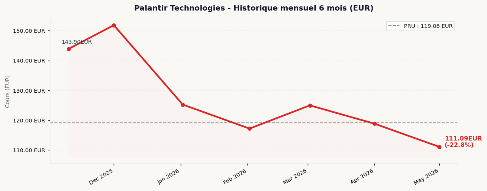
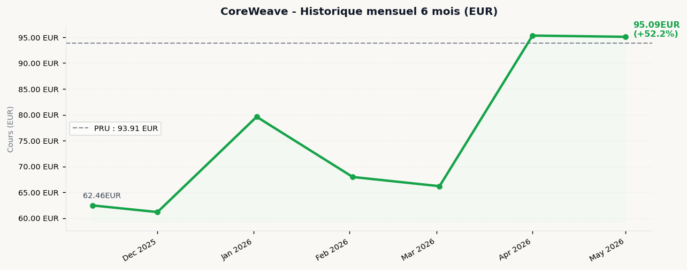
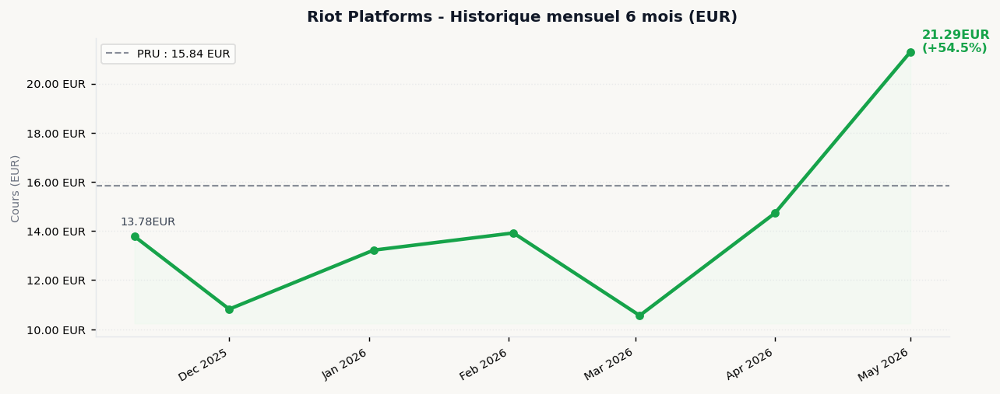
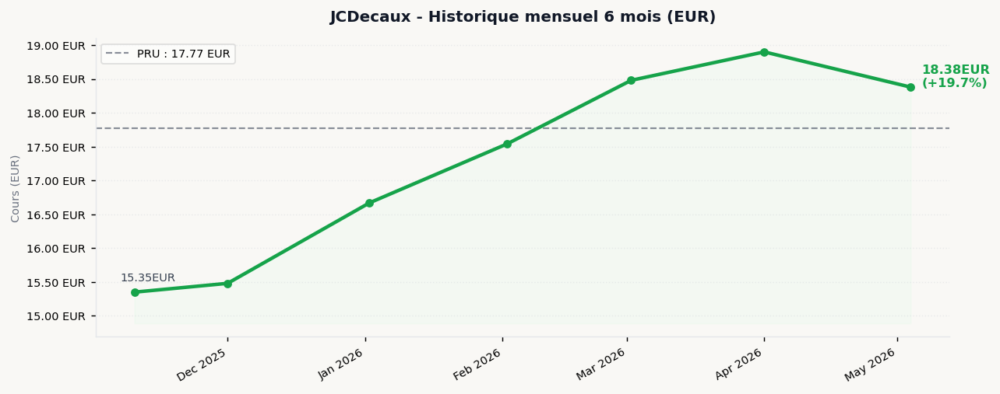
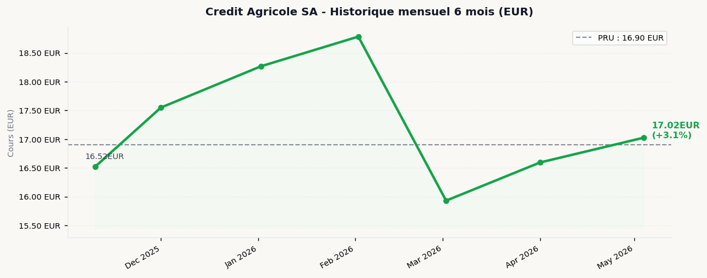
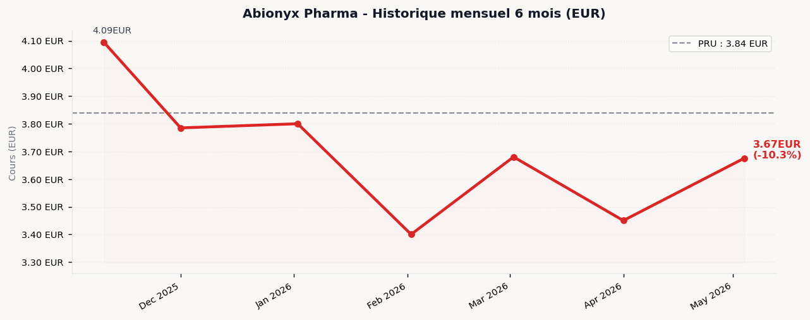

# Rapport de Portefeuille v5.2 -- 14/05/2026 16:37 (Paris)

---

## Contexte Economique

**Tendance : Neutre** | Score macro : 5.1/10
**EUR/USD :** 1 EUR = 1.1698 USD

| Indice | Variation | Cours |
|--------|-----------|-------|
| S&P 500 | ^ +0.53% | 7,483.67 |
| CAC 40 | ^ +0.84% | 8,074.86 |
| Nikkei 225 | v -0.98% | 62,654.05 |

**Manchettes macro :**

- Notice of the Annual General Meeting of Akcinė prekybos bendrovė “APRANGA” shareholders
- Pranešimas apie Akcinės prekybos bendrovės „APRANGA“ šaukiamą eilinį visuotinį akcininkų susirinkimą
- BIC discontinues Rocketbook and its Skin Creative activities
- BIC discontinue les activités de Rocketbook et de Skin Creative
- BIC annonce la nomination d’un nouveau Directeur Financier

---

## Analyse par Valeur

### Palantir Technologies `PLTR.US`

| Cours | Variation | VM | P&L Brut | P&L Net | Score | Recomm. |
|-------|-----------|-----|----------|---------|-------|---------|
| 112.70 EUR | - +0.00% | 225.39 EUR | - -12.73 EUR (-5.3%) | - -26.63 EUR (-10.9%) | **4.8/10** | GARDER |

**Actualites recentes :**

- High Growth Tech Stocks in US for May 2026
- When It Comes to Palantir, the Roar of the Bears Is Too Loud to Ignore

**Sentiment :** Bull 85% / Bear 15% *(source : Lexical (AV:vide, FH:HTTP 403))*
**Consensus :** SB:11 B:15 H:10 S:1 SS:1 *(source : Finnhub)*

**Momentum mensuel :** BAISSIER (1M: -6.5% / 3M: -5.2% / 6M: -22.8%) *(source : Cache)*

**Justification :** Perte nette -26.63 EUR (-10.9%) apres frais. Consensus haussier (score 7.2/10, Bull 85%). Contexte macro neutre. Momentum mensuel BAISSIER (score historique 1.0/10).

---

### CoreWeave `CRWV.US`

| Cours | Variation | VM | P&L Brut | P&L Net | Score | Recomm. |
|-------|-----------|-----|----------|---------|-------|---------|
| 99.79 EUR | - +0.00% | 199.58 EUR | + +11.76 EUR (+6.3%) | - -2.14 EUR (-1.1%) | **6.9/10** | ACHAT MODERE |

**Actualites recentes :**

- Nebius: Still Stealing CoreWeave's Lunch Money
- CoreWeave: Q1 Confirmed The Math Doesn't Work

**Sentiment :** Bull 60% / Bear 40% *(source : Lexical (AV:vide, FH:HTTP 403))*
**Consensus :** SB:10 B:18 H:12 S:1 SS:1 *(source : Finnhub)*

**Momentum mensuel :** HAUSSIER (1M: -0.3% / 3M: +39.9% / 6M: +52.2%) *(source : Cache)*

**Justification :** Perte nette -2.14 EUR (-1.1%) apres frais. Consensus haussier (score 7.1/10, Bull 60%). Contexte macro neutre. Momentum mensuel HAUSSIER (score historique 8.5/10).

---

### Riot Platforms `RIOT.US`

| Cours | Variation | VM | P&L Brut | P&L Net | Score | Recomm. |
|-------|-----------|-----|----------|---------|-------|---------|
| 20.85 EUR | - +0.00% | 125.10 EUR | + +30.06 EUR (+31.6%) | + +16.16 EUR (+15.8%) | **8.2/10** | ACHAT FORT |

**Actualites recentes :**

- Riot Platforms: Long-Term Strong Growth Ahead After A Possible Near-Term Pullback (Rating Upgrade)

**Sentiment :** Bull 59% / Bear 41% *(source : AlphaVantage NLP)*
**Consensus :** SB:6 B:17 H:2 S:0 SS:0 *(source : Finnhub)*

**Momentum mensuel :** HAUSSIER (1M: +44.5% / 3M: +52.9% / 6M: +54.5%) *(source : Cache)*

**Justification :** Gain net +16.16 EUR (+15.8%) apres frais. Consensus haussier (score 7.9/10, Bull 59%). Contexte macro neutre. Momentum mensuel HAUSSIER (score historique 10.0/10).

---

### JCDecaux `DEC.PA`

| Cours | Variation | VM | P&L Brut | P&L Net | Score | Recomm. |
|-------|-----------|-----|----------|---------|-------|---------|
| 18.79 EUR | ^ +2.23% | 37.58 EUR | + +2.04 EUR (+5.7%) | - -1.94 EUR (-5.2%) | **6.4/10** | ACHAT MODERE |

**Actualites recentes :**

- 2026 Annual General Meeting of JCDecaux SE of 13 May 2026
- A Look At JCDecaux (ENXTPA:DEC) Valuation After Recent Share Price Momentum

**Sentiment :** Bull 100% / Bear 0% *(source : Lexical EODHD (Finnhub:HTTP 403))*
**Consensus :** N/D *(source : Neutre par defaut (Finnhub:HTTP 403, EODHD:HTTP 403))*

**Momentum mensuel :** NEUTRE (1M: -2.8% / 3M: +4.8% / 6M: +19.7%) *(source : EODHD)*

**Justification :** Perte nette -1.94 EUR (-5.2%) apres frais. Consensus neutre (100% bull / 0% bear). Contexte macro neutre. Momentum mensuel NEUTRE (score historique 5.8/10).

---

### Credit Agricole SA `ACA.PA`

| Cours | Variation | VM | P&L Brut | P&L Net | Score | Recomm. |
|-------|-----------|-----|----------|---------|-------|---------|
| 17.21 EUR | ^ +1.09% | 172.10 EUR | + +3.10 EUR (+1.8%) | - -0.88 EUR (-0.5%) | **4.0/10** | A EVITER |

**Actualites recentes :**

- CREDIT AGRICOLE S.A. ANNOUNCES REDEMPTION OF ¥14,500,000,000 Japanese Yen Callable Senior Non-Preferred Bonds issued on June 13, 2023 (ISIN: JP525022DP63)

**Sentiment :** Bull 0% / Bear 0% *(source : Lexical EODHD (Finnhub:HTTP 403))*
**Consensus :** N/D *(source : Neutre par defaut (Finnhub:HTTP 403, EODHD:HTTP 403))*

**Momentum mensuel :** NEUTRE (1M: +2.6% / 3M: -9.4% / 6M: +3.1%) *(source : EODHD)*

**Justification :** Perte nette -0.88 EUR (-0.5%) apres frais. Consensus neutre (0% bull / 0% bear). Contexte macro neutre. Momentum mensuel NEUTRE (score historique 4.8/10).

---

### Abionyx Pharma `ABNX.PA`

| Cours | Variation | VM | P&L Brut | P&L Net | Score | Recomm. |
|-------|-----------|-----|----------|---------|-------|---------|
| 3.69 EUR | ^ +0.54% | 36.95 EUR | - -1.45 EUR (-3.8%) | - -5.43 EUR (-13.4%) | **5.4/10** | GARDER |

**Actualites recentes :**

- Aucune actualite disponible

**Sentiment :** Bull 50% / Bear 50% *(source : Neutre par defaut (Finnhub:HTTP 403))*
**Consensus :** N/D *(source : Neutre par defaut (Finnhub:HTTP 403, EODHD:HTTP 403))*

**Momentum mensuel :** HAUSSIER (1M: +6.5% / 3M: +8.1% / 6M: -10.3%) *(source : EODHD)*

**Justification :** Perte nette -5.43 EUR (-13.4%) apres frais. Consensus neutre (50% bull / 50% bear). Contexte macro neutre. Momentum mensuel HAUSSIER (score historique 6.8/10).

---

## Synthese Portefeuille

| Cout total | Valeur marche | P&L Brut | P&L Net |
|------------|---------------|----------|---------|
| 763.92 EUR | 796.70 EUR | - +32.78 EUR (+4.3%) | - -20.86 EUR (-2.7%) |

---

### Classement par Score

| Valeur | VM | P&L Net | Score | Recomm. |
|--------|----|---------|-------|---------|
| Riot Platforms | 125.10 EUR | + +16.16 EUR (+15.8%) | **8.2/10** | ACHAT FORT |
| CoreWeave | 199.58 EUR | - -2.14 EUR (-1.1%) | **6.9/10** | ACHAT MODERE |
| JCDecaux | 37.58 EUR | - -1.94 EUR (-5.2%) | **6.4/10** | ACHAT MODERE |
| Abionyx Pharma | 36.95 EUR | - -5.43 EUR (-13.4%) | **5.4/10** | GARDER |
| Palantir Technologies | 225.39 EUR | - -26.63 EUR (-10.9%) | **4.8/10** | GARDER |
| Credit Agricole SA | 172.10 EUR | - -0.88 EUR (-0.5%) | **4.0/10** | A EVITER |

---

## Watchlist

**NVIDIA** `NVDA` -- IA / Semi-conducteurs | Cours : 200.40 EUR *(source : TwelveData)*

- Stock Market Today: Dow Revisits The 50,000 Level On Cisco, Nvidia, Boeing; Trump, Xi Meet (Live Coverage)
- 3 Dividend Stocks to Double Up On Right Now

**Microsoft** `MSFT` -- IA / Cloud | Cours : 348.53 EUR *(source : TwelveData)*

- Meta Stock: Big Growth, Big Discount, Big Buy
- Why The Market Is Re-Rating Google Stock

**Coinbase** `COIN` -- Crypto / Fintech | Cours : 171.92 EUR *(source : TwelveData)*

- Bullish Earnings Fall Short As Crypto Trading Weakens
- Coinbase (COIN) Shares Skyrocket, What You Need To Know

**LVMH** `MC.PA` -- Luxe / Consommation | Cours : 462.25 EUR *(source : EODHD)*

**TotalEnergies** `TTE.PA` -- Energie | Cours : 78.11 EUR *(source : EODHD)*

**Airbus** `AIR.PA` -- Aeronautique / Defense | Cours : N/D *(source : N/D)*

---

## Informations Techniques

**Quotas API :** alphavantage: 7/23 | twelvedata: 1/60 | eodhd: 18/18 | finnhub: 20/55
**Sources utilisees :** {"EUR/USD": "AlphaVantage", "S&P 500": "EODHD", "CAC 40": "EODHD", "Nikkei 225": "EODHD", "PLTR.US": {"cours": "TwelveData", "sentiment": "Lexical (AV:vide, FH:HTTP 403)", "consensus": "Finnhub", "historique": "Cache"}, "CRWV.US": {"cours": "TwelveData", "sentiment": "Lexical (AV:vide, FH:HTTP 403)", "consensus": "Finnhub", "historique": "Cache"}, "RIOT.US": {"cours": "TwelveData", "sentiment": "AlphaVantage NLP", "consensus": "Finnhub", "historique": "Cache"}, "DEC.PA": {"cours": "EODHD", "sentiment": "Lexical EODHD (Finnhub:HTTP 403)", "consensus": "Neutre par defaut (Finnhub:HTTP 403, EODHD:HTTP 403)", "historique": "EODHD"}, "ACA.PA": {"cours": "EODHD", "sentiment": "Lexical EODHD (Finnhub:HTTP 403)", "consensus": "Neutre par defaut (Finnhub:HTTP 403, EODHD:HTTP 403)", "historique": "EODHD"}, "ABNX.PA": {"cours": "EODHD", "sentiment": "Neutre par defaut (Finnhub:HTTP 403)", "consensus": "Neutre par defaut (Finnhub:HTTP 403, EODHD:HTTP 403)", "historique": "EODHD"}}

**Avertissements cache :**

- Palantir Technologies -- historique : Historique US non disponible (AV:vide, FH:HTTP 403) -- cache du 14/05/2026 11:43
- CoreWeave -- historique : Historique US non disponible (AV:vide, FH:HTTP 403) -- cache du 14/05/2026 11:43
- Riot Platforms -- historique : Historique US non disponible (AV:vide, FH:HTTP 403) -- cache du 14/05/2026 11:43

*Rapport genere le 14/05/2026 a 16:37 (heure de Paris)*
*Charts generes : 6*